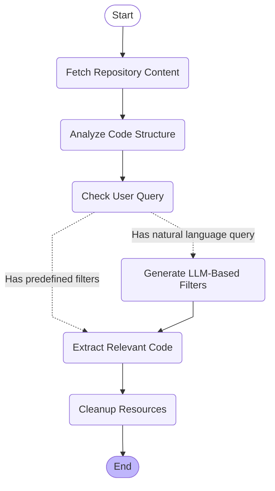

# Repo2Prompt

🔍 A backend service that helps you find the exact code you need from any Git repository using natural language queries, and transforms the filtered content into prompt-friendly format for LLMs.

> This project is inspired by and heavily references [GitIngest](https://github.com/cyclotruc/gitingest). While maintaining the core concept of repository content extraction, I've made three main changes:
> 1. Added Large Language Models for natural language understanding
> 2. Adapted the architecture to use the LangGraph framework
> 3. Restructured as a backend-only service with RESTful APIs

## 🚀 Features

- **Natural Language Code Finding**: Simply describe what code you want to find or exclude in plain English
- **Smart Code Filtering**: LLM understands your needs and automatically figures out which files to include or exclude
- **Context-Aware Search**: Takes into account both your description and the repository structure
- **Advanced Processing Pipeline**:
  - Smart repository structure analysis
  - Natural language understanding
  - Intelligent code filtering
  - Clean result extraction
- **RESTful API**: Easy integration with other services
- **Flexible Configuration**: Customizable file size limits and filtering options

## 🏗️ Architecture

The project is built using a state machine workflow powered by LangGraph, consisting of the following nodes:



Each node serves a specific purpose:

1. **Fetch Repository Content**: Clone and prepare the target repository
2. **Analyze Code Structure**: Scan and understand the repository structure
3. **Check User Query**: Determine if natural language processing is needed
4. **Generate LLM-Based Filters**: Convert natural language to code filters
5. **Extract Relevant Code**: Apply filters and extract matching content
6. **Cleanup Resources**: Clean up temporary files and resources

## 🛠️ Tech Stack

- **FastAPI**: Modern web framework for building APIs
- **LangGraph**: State machine workflow framework
- **LangChain**: LLM integration and chain management
- **Git**: Repository management
- **Pydantic**: Data validation and settings management

## 📦 Installation

```bash
pip install -r requirements.txt
```

## 🚀 Usage

### Starting the Server

```bash
uvicorn src.main:app --reload-include "src/**/*"
```

### API Endpoint

```bash
POST /api/analyze
```

Request body:
```json
{
    "url": "https://github.com/username/repo",
    "query": "I want to get the code that is related to the user authentication"
}
```

## 🌟 Key Differences from GitIngest

1. **LangGraph Integration**: Implemented a state machine workflow for more complex processing
2. **LLM Capabilities**: Added intelligent pattern generation and content analysis
3. **Enhanced Processing**: More sophisticated repository analysis and content processing
4. **Modular Architecture**: Better separation of concerns and extensibility
5. **API-First Design**: Focus on programmatic access and integration

## 🔧 Development

1. Clone the repository
```bash
git clone https://github.com/yourusername/repo2prompt.git
cd repo2prompt
```

2. Install development dependencies
```bash
pip install -r requirements.txt
```

3. Set up environment variables
```bash
cp .env.example .env
# Edit .env with your configuration
```

## 📝 License

MIT License

## 🤝 Contributing

Contributions are welcome! Please feel free to submit a Pull Request.
